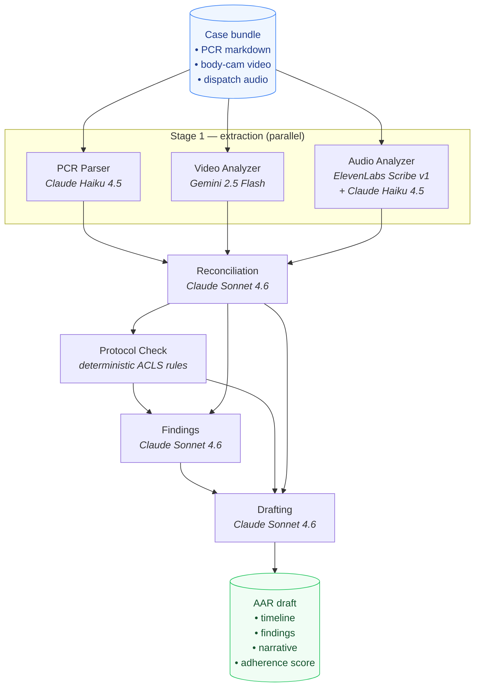
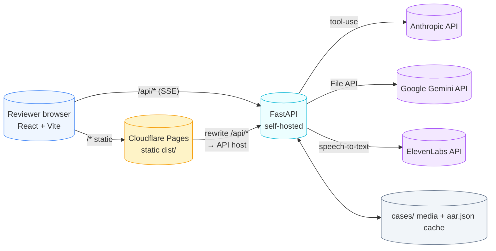

# Sentinel — Architecture

Sentinel is a two-tier system: a Python pipeline orchestrator that calls
multiple LLM providers, and a React UI that streams progress and renders
the resulting After-Action Report (AAR).

## Pipeline overview

### Stage budget

| Stage | Model | Why this model |
|---|---|---|
| PCR parsing | Claude Haiku 4.5 | Fast structured extraction, tool-use enum lock to schema |
| Video analysis | Gemini 2.5 Flash | Native long-form video understanding via File API |
| Audio analysis | ElevenLabs Scribe v1 → Claude Haiku 4.5 | Best-in-class word-timestamp ASR, Haiku turns transcript spans into Events |
| Reconciliation | Claude Sonnet 4.6 | Multi-source temporal reasoning needs the bigger model |
| Protocol check | deterministic | ACLS rule engine — no LLM needed, fully reproducible |
| Findings | Claude Sonnet 4.6 | Cross-reference timeline + protocol checks against five discrepancy categories |
| Drafting | Claude Sonnet 4.6 | Two sequential calls (summary, then narrative) for prose quality |

### Data flow

1. **Stage 1 (parallel)** — three independent extractors emit `Event` objects
   (`source` ∈ {`pcr`, `video`, `audio`}). Each runs as its own
   `asyncio.Task`; results are joined via `asyncio.gather`.
2. **Reconciliation** merges the three event streams into a single
   `TimelineEntry[]` with `match_confidence` and `has_discrepancy`. Soft
   ~60-second matching window; cross-source spread > 10s forces the
   discrepancy flag.
3. **Protocol check** runs deterministic ACLS-cardiac-arrest rules over
   the timeline (epi every 3-5min, defib timing, airway placement, etc.).
4. **Findings** asks Sonnet to surface concrete issues across five
   categories: timing discrepancy, missing documentation, phantom
   intervention, protocol deviation, care gap. Output is grounded by
   `evidence_event_ids` that must exist in the input timeline.
5. **Drafting** issues two Sonnet calls — first a 2-3 paragraph summary,
   then a 3-4 paragraph narrative seeded by the summary — and computes
   `adherence_score = ADHERENT / (ADHERENT + DEVIATION)` deterministically.

The whole pipeline is wrapped in `process_case()` (see
`backend/app/pipeline/orchestrator.py`); each stage emits
`PipelineProgress` events that flow over SSE to the UI.

## System topology

- The frontend is fully static, deployed to Cloudflare Pages.
  `VITE_API_URL` points it at the self-hosted FastAPI instance in
  production; in dev the Vite proxy forwards `/api/*` to `localhost:8000`.
- The backend is self-hosted because we need access to local case media
  files that aren't appropriate to put on edge object storage.
- Cached AARs live alongside the case media in `cases/<id>/aar.json`,
  written automatically after every successful live pipeline run and
  served instantly via `GET /api/cases/<id>/aar`.

## Demo mode

When `?demo=1` is on the URL or `VITE_DEMO_MODE=1` is set at build time:

- The frontend bundles a fallback fixture (`/demo/sample_aar.json` and
  `/demo/sample_pcr.md`) so the UI loads even if the backend is down.
- The "Replay Pipeline" button hits `GET /api/cases/<id>/stream?demo=1`,
  which emits the same SSE shape as the real pipeline but with synthetic
  per-stage delays and the cached AAR at the end.
- If even that endpoint is unreachable, the frontend falls back to a
  fully client-side synthetic stream so the demo still completes.

The combination guarantees the live demo never goes blank on a flaky
network or a quota-exhausted API key.

## Schema contract

`backend/app/schemas.py` is the single source of truth.
`frontend/src/types/schemas.ts` mirrors it field-for-field (snake_case
preserved both sides — no translation layer).

Once Phase 1 locked these contracts, every subsequent stage built
against them: backend stubs, real LLM stages, frontend rendering, and
the demo fixture all share the same shape. That's why the frontend can
do `JSON.parse(...) as AARDraft` and the demo fixture can be reused as a
backend seed.
